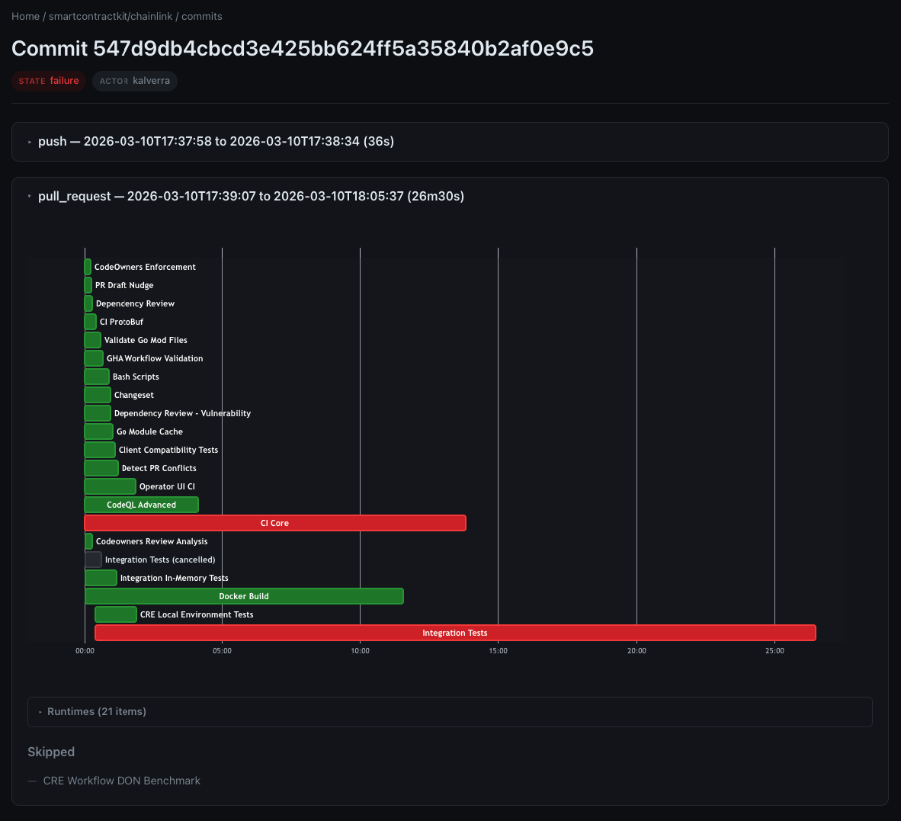

# Octometrics

A simple CLI tool to visualize and profile your GitHub Actions workflows. See all the processes that run as part of a PR, workflow, or job in a simple, interactive chart. It can also run [directly in your GitHub Actions flow](https://github.com/kalverra/octometrics-action), useful for debugging changes and performance issues.



## Run

Before running, make sure to provide GitHub API token, either through the `GITHUB_TOKEN` env var, or the `-t` flag.

```sh
# Install
go install github.com/kalverra/octometrics

# Show help menu
octometrics -h

# To see all workflows run on all commits a part of this PR (including merge queue runs): https://github.com/kalverra/octometrics/pull/33
octometrics gather -o kalverra -r octometrics -p 33

# To see all workflows run on a specific commit: https://github.com/kalverra/octometrics/pull/33/changes/94ad3f7e2f45852a99791326847ea12c94b964dc
octometrics gather -o kalverra -r octometrics -c 94ad3f7e2f45852a99791326847ea12c94b964dc

# To see a specific workflow run: https://github.com/kalverra/octometrics/actions/runs/22918636165
octometrics gather -o kalverra -r octometrics -w 22918636165

# Use '-u' to force update local data if it already exists
octometrics gather -o kalverra -r octometrics -p 33 -u
```

## GitHub Action

Run `monitor` directly in your GitHub action and it will post performance data as a comment and summary to the action run. [See the octometrics-action](https://github.com/kalverra/octometrics-action).

Highly inspired by the [workflow-telemetry-action](https://github.com/catchpoint/workflow-telemetry-action/tree/master).
