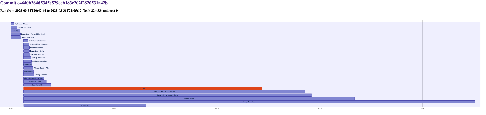

# Octometrics

A simple CLI tool to visualize and profile your GitHub Actions workflows. See all the processes that run as part of a PR, workflow, or job in a simple, interactive chart. It can also run [directly in your GitHub Actions flow](https://github.com/kalverra/octometrics-action), useful for debugging changes and performance issues.



## Run

```sh
# Show help menu
go run . -h
```

## Monitor

This will launch a background process to monitor stats like CPU and memory usage. This can be run on GHA runners so that when you later `gather` and `observe` the data, you will also have detailed profiling info.

```sh
go run . monitor
```

### GitHub Action

Run `monitor` directly in your GitHub action and it will post performance data as a comment and summary to the action run. [See the octometrics-action](https://github.com/kalverra/octometrics-action).

Highly inspired by the [workflow-telemetry-action](https://github.com/catchpoint/workflow-telemetry-action/tree/master).
