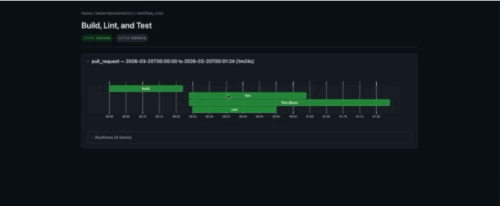

# Octometrics

A simple CLI (and now GUI!) tool to visualize and profile your GitHub Actions workflows. See all the processes that run as part of a PR, workflow, or job in a simple, interactive chart. It can also run [directly in your GitHub Actions flow](https://github.com/kalverra/octometrics-action), useful for debugging changes and performance issues.

<div align="center">



</div>

## Run

```sh
# Set your GITHUB_TOKEN to avoid rate limits
export GITHUB_TOKEN=$(gh auth token)

# Launch interactive UI home page
octometrics

# Show CLI help menu
octometrics -h
```

## Install

### Go

```sh
go install github.com/kalverra/octometrics@latest
```

### Homebrew

```sh
brew install kalverra/tap/octometrics
```

### mise

```sh
# Prebuilt GitHub release binary
mise use github:kalverra/octometrics

# Compile from Go source
mise use go:github.com/kalverra/octometrics@latest
```

## GitHub Action

Run `monitor` directly in your GitHub action and it will post performance data as a comment and summary to the action run. [See the octometrics-action](https://github.com/kalverra/octometrics-action).

## Contributing

I recommend using [mise](https://mise.jdx.dev/) for tool version control and as a makefile replacement. Use [lefthook](https://lefthook.dev/) for pre-commit and pre-push hooks. (Or just use plain go commands).

```sh
mise install      # Install tools
mise run hooks    # Install lefthook git hooks
mise run lint     # Run linters
mise run test     # Run tests
```

---

Highly inspired by the [workflow-telemetry-action](https://github.com/catchpoint/workflow-telemetry-action/tree/master).
