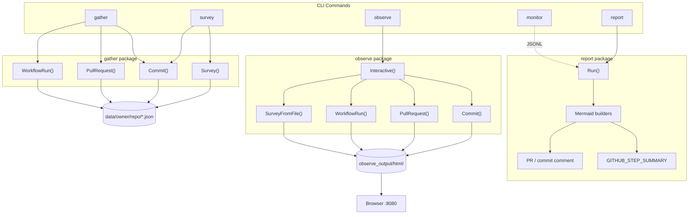
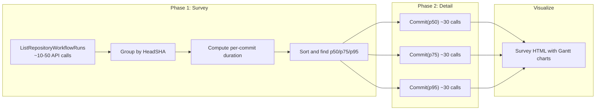
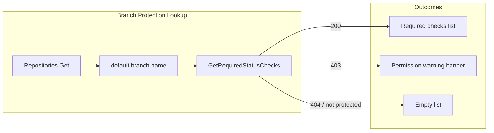
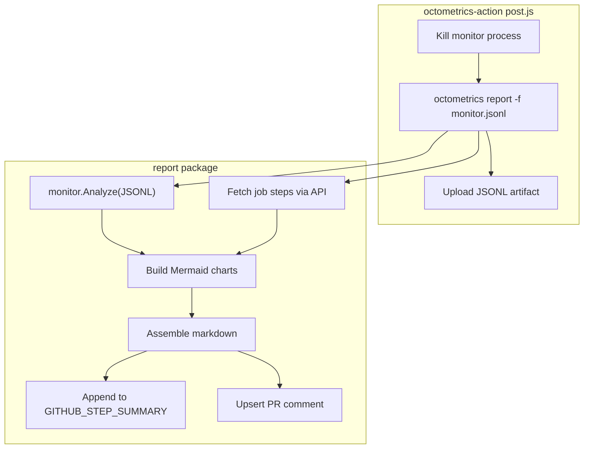

# Octometrics Design

Octometrics is a Go CLI tool that gathers detailed GitHub Actions workflow runtime data via the GitHub REST and GraphQL APIs, stores it locally as JSON, and visualizes it as interactive Gantt-style timelines in the browser. It supports per-commit, per-PR, and aggregate percentile views of CI suite performance.

## Command Flow

## Survey Two-Phase Architecture

The `survey` command efficiently identifies p50/p75/p95 CI suite runs without exhausting GitHub API rate limits. It uses a two-phase approach: a lightweight listing phase, then targeted detail gathering.

## Branch Protection Required Checks

During observation rendering, octometrics fetches the default branch's required status checks via `Repositories.Get` (to discover the default branch name) and `Repositories.GetRequiredStatusChecks`. Results are cached per `owner/repo` to avoid redundant API calls across observations in the same repository. Timeline items whose names match a required check are marked `IsRequired` and highlighted in the visualization.

The `GetRequiredStatusChecks` endpoint requires **Administration: Read** permission. When the token lacks this permission (403), the observation renders a small warning banner instead of failing. When the branch is unprotected or has no required checks, the section is simply omitted.

## Report: In-Action Monitoring Summary

The `report` command runs in the GitHub Actions `post` step (after the monitor process is killed) and produces an inline Mermaid-based summary without generating or hosting images. It analyzes the monitor's JSONL output for resource metrics and calls the GitHub API for job step timing.

The report uses Mermaid `gantt` for the step timeline and `xychart-beta` for CPU, memory, disk, and I/O line charts. Monitoring data is downsampled to ~40 points per chart. A compact metric summary table with peak/average values accompanies the charts. For PR workflows, the report upserts a comment identified by an HTML marker so re-runs update in place rather than creating duplicates.

## Key Design Decisions

- **Local JSON cache**: All gathered data is stored as JSON in `data/` and re-read on subsequent runs, avoiding redundant API calls. `ForceUpdate` bypasses the cache.
- **Rate limit awareness**: The REST client uses `go-github-ratelimit` to automatically sleep when rate-limited. Survey's two-phase design reduces total API calls from O(commits x workflows x jobs) to O(listing_pages + 3 x detail_calls).
- **Real representative commits for percentiles**: Rather than constructing synthetic "average" timelines, the survey picks actual commits whose CI duration falls at each percentile. This shows real job distributions and integrates with existing Gantt visualization.
- **Mermaid Gantt for timelines**: Workflow/job/step timing is rendered as Mermaid Gantt charts, giving a visual representation of parallelism and duration without requiring a charting library.
- **Mermaid xychart-beta for monitoring metrics**: CPU, memory, disk, and I/O from optional `octometrics monitor` instrumentation use the same Mermaid `xychart-beta` definitions in both the `observe` HTML view and the `report` command (GitHub Step Summaries / PR comments).
- **Observe chart width**: The interactive `observe` page sets shared Mermaid `useMaxWidth`, a common `xyChart` width/height, and CSS so Gantt and xychart SVGs fill the same column; GitHub-rendered reports are unchanged.
- **Graceful degradation for branch protection**: Branch protection data enriches visualizations when available but never blocks rendering. A 403 produces a small UI warning; a 404 or unprotected branch silently omits the section.
