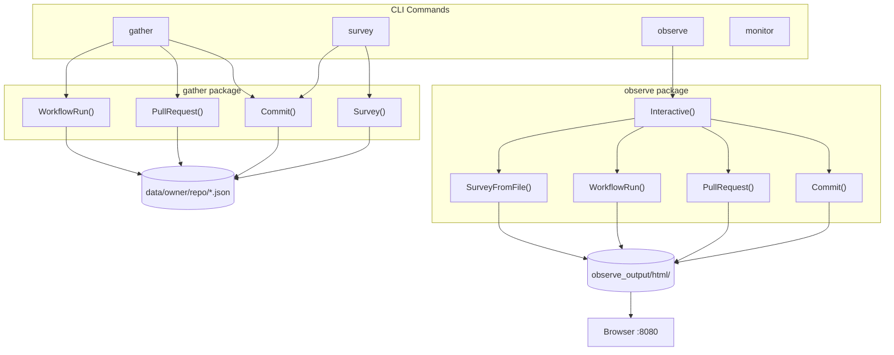
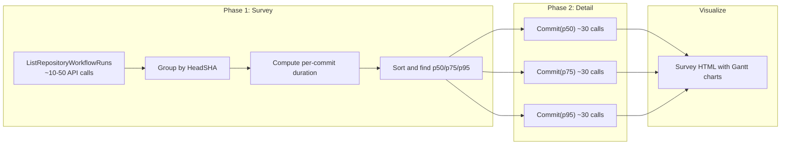

# Octometrics Design

Octometrics is a Go CLI tool that gathers detailed GitHub Actions workflow runtime data via the GitHub REST and GraphQL APIs, stores it locally as JSON, and visualizes it as interactive Gantt-style timelines in the browser. It supports per-commit, per-PR, and aggregate percentile views of CI suite performance.

## Command Flow

## Survey Two-Phase Architecture

The `survey` command efficiently identifies p50/p75/p95 CI suite runs without exhausting GitHub API rate limits. It uses a two-phase approach: a lightweight listing phase, then targeted detail gathering.

## Key Design Decisions

- **Local JSON cache**: All gathered data is stored as JSON in `data/` and re-read on subsequent runs, avoiding redundant API calls. `ForceUpdate` bypasses the cache.
- **Rate limit awareness**: The REST client uses `go-github-ratelimit` to automatically sleep when rate-limited. Survey's two-phase design reduces total API calls from O(commits x workflows x jobs) to O(listing_pages + 3 x detail_calls).
- **Real representative commits for percentiles**: Rather than constructing synthetic "average" timelines, the survey picks actual commits whose CI duration falls at each percentile. This shows real job distributions and integrates with existing Gantt visualization.
- **Mermaid Gantt for timelines**: Workflow/job/step timing is rendered as Mermaid Gantt charts, giving a visual representation of parallelism and duration without requiring a charting library.
- **Plotly for monitoring data**: CPU, memory, disk, and I/O metrics from optional `octometrics monitor` instrumentation are rendered using Plotly.js.
