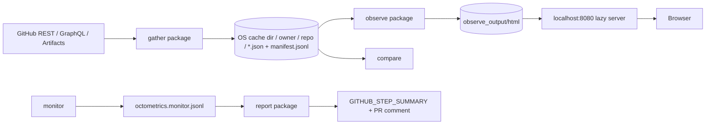
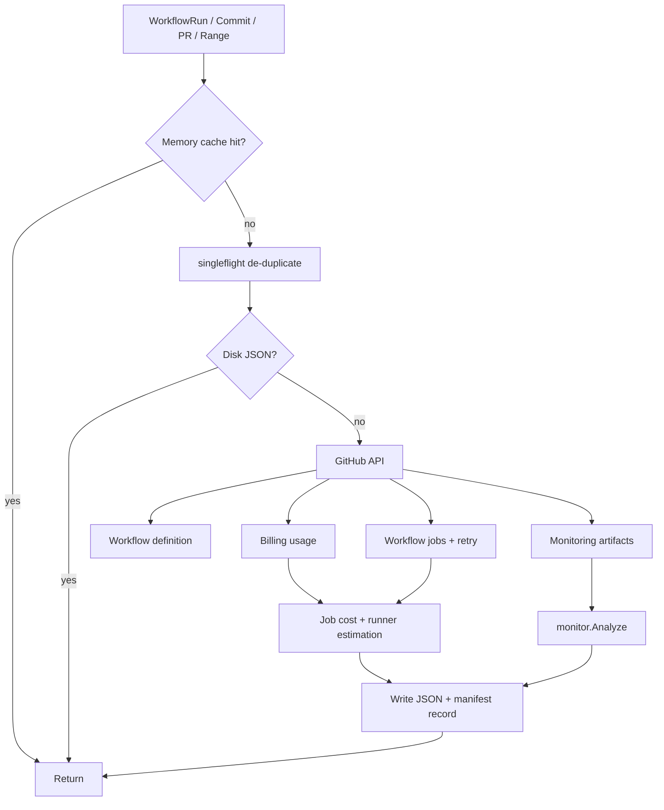
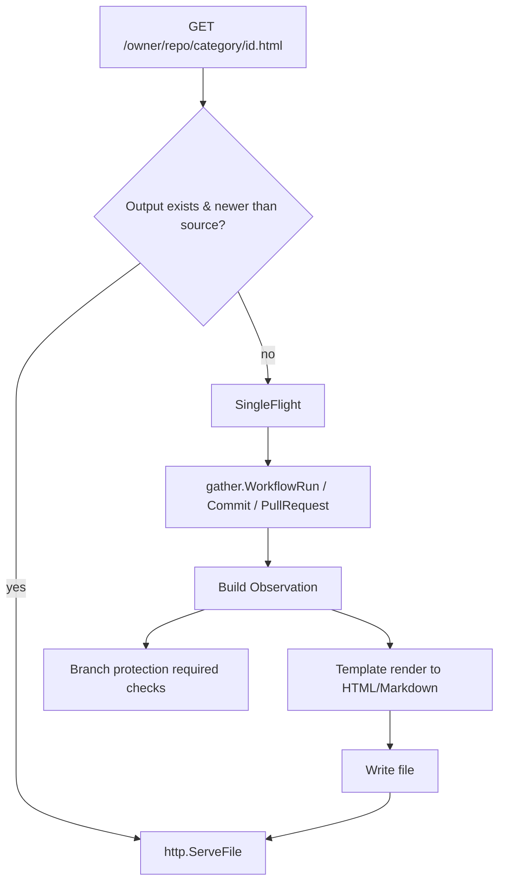
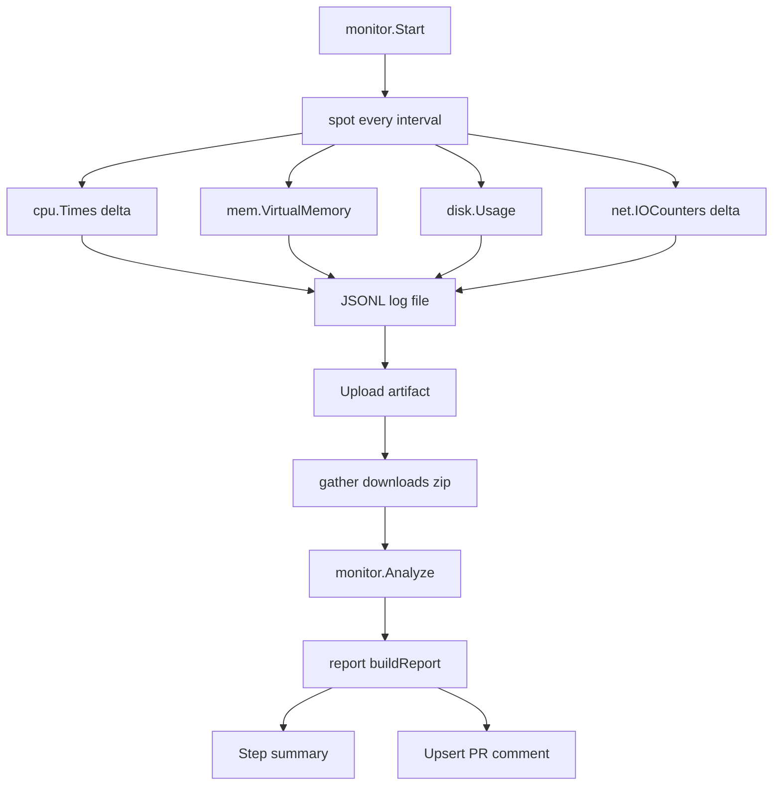

# Octometrics Design

Octometrics is a Go CLI that profiles GitHub Actions workflows. It fetches workflow data via the GitHub REST and GraphQL APIs, stores it locally as JSON, and renders it as interactive Mermaid charts in the browser or as markdown reports inside GitHub Actions.

## Commands

- `octometrics` (root) — fetch and observe workflow runs, commits, pull requests, and cost data.
- `compare` — diff two runs or two commits side-by-side.
- `monitor` — run inside a GitHub Action job to sample CPU, memory, disk, and network IO.
- `report` — run as a GitHub Action post-step to summarize monitoring data in the job summary and as a PR comment.

## Data Flow

```mermaid
flowchart LR
    GitHub[GitHub REST / GraphQL / Artifacts] --> gather[gather package]
    gather --> Cache[(OS cache dir / owner / repo / *.json + manifest.jsonl)]
    Cache --> observe[observe package]
    Cache --> compare[compare]
    observe --> HTML[(observe_output/html)]
    HTML --> Server[localhost:8080 lazy server]
    Server --> Browser[Browser]
    monitor --> JSONL[octometrics.monitor.jsonl]
    JSONL --> report[report package]
    report --> Summary[GITHUB_STEP_SUMMARY + PR comment]
```

## Gather Flow

```mermaid
flowchart TD
    Request[WorkflowRun / Commit / PR / Range] --> Cache{Memory cache hit?}
    Cache -->|yes| Return
    Cache -->|no| SingleFlight[singleflight de-duplicate]
    SingleFlight --> Disk{Disk JSON?}
    Disk -->|yes| Return
    Disk -->|no| GitHub[GitHub API]
    GitHub --> Billing[Billing usage]
    GitHub --> Jobs[Workflow jobs + retry]
    GitHub --> Def[Workflow definition]
    GitHub --> Artifacts[Monitoring artifacts]
    Billing & Jobs --> Cost[Job cost + runner estimation]
    Artifacts --> Analyze[monitor.Analyze]
    Cost & Analyze --> Save[Write JSON + manifest record]
    Save --> Return
```

## Observe Lazy Serving

```mermaid
flowchart TD
    Request[GET /owner/repo/category/id.html] --> DiskCheck{Output exists & newer than source?}
    DiskCheck -->|yes| Serve[http.ServeFile]
    DiskCheck -->|no| SingleFlight
    SingleFlight --> Load[gather.WorkflowRun / Commit / PullRequest]
    Load --> Build[Build Observation]
    Build --> BranchProtection[Branch protection required checks]
    Build --> Render[Template render to HTML/Markdown]
    Render --> Write[Write file]
    Write --> Serve
```

## Monitor + Report Flow

```mermaid
flowchart TD
    Start[monitor.Start] --> Spot[spot every interval]
    Spot --> CPU[cpu.Times delta]
    Spot --> Memory[mem.VirtualMemory]
    Spot --> Disk[disk.Usage]
    Spot --> IO[net.IOCounters delta]
    CPU & Memory & Disk & IO --> JSONL[JSONL log file]
    JSONL --> Artifact[Upload artifact]
    Artifact --> Download[gather downloads zip]
    Download --> Analyze[monitor.Analyze]
    Analyze --> BuildReport[report buildReport]
    BuildReport --> Summary[Step summary]
    BuildReport --> Comment[Upsert PR comment]
```

## Key Design Decisions

- **Local JSON cache**: All data is stored under the OS cache directory (`~/Library/Caches/octometrics` or `~/.cache/octometrics`). Override with `--data-dir`, `DATA_DIR`, or `data_dir` in config. `ForceUpdate` bypasses the cache.
- **UI Navigation & Browsing**: The web interface features a home page (`GET /`) with live GitHub search and local data search, persistent favorites and recents (`ui_state.json`), and repo overview pages (`GET /{owner}/{repo}`) listing live workflows, runs, commits, and PRs with click-to-fetch affordances (`↓`). Read-only GitHub listing calls in `gather/browse.go` are cached in memory with a 60s TTL.
- **Cache-Miss Interstitials**: Entity cache misses return `202 Accepted` with a `<meta http-equiv="refresh">` pending interstitial (`pending.html`) while gathering and rendering in the background, avoiding blocked requests.
- **Rate limit awareness**: REST client uses `go-github-ratelimit`. `loggingTransport` logs per-request headers and warns when remaining calls drop below 50.
- **Mermaid charts**: Timelines use `gantt`; monitoring metrics use `xychart-beta`. Shared xychart sizing is applied in HTML to keep Gantt and xychart widths aligned.
- **Branch protection**: Required status checks for the default branch are fetched per repo and cached per session. A 403 renders a warning instead of failing; 404 omits the section.
- **Commit conclusion aggregation**: Conclusions fold with priority `failure` > `timed_out` > `cancelled` > `in_progress` > `success` after all workflow runs are known.
- **Monitor sampling**: CPU usage is computed from successive `cpu.Times` deltas; network IO logs per-interval deltas; disk usage defaults to `GITHUB_WORKSPACE` when set.
- **Compare matching**: Items are matched by stable ID first, then by normalized name stripped of status suffixes like `(in progress)` or `(attempt N)`.
- **Cost model**: Job costs are computed from GitHub's billing API when available, otherwise estimated from runner labels and duration. Rates are defined in `gather/workflow_run.go`.
